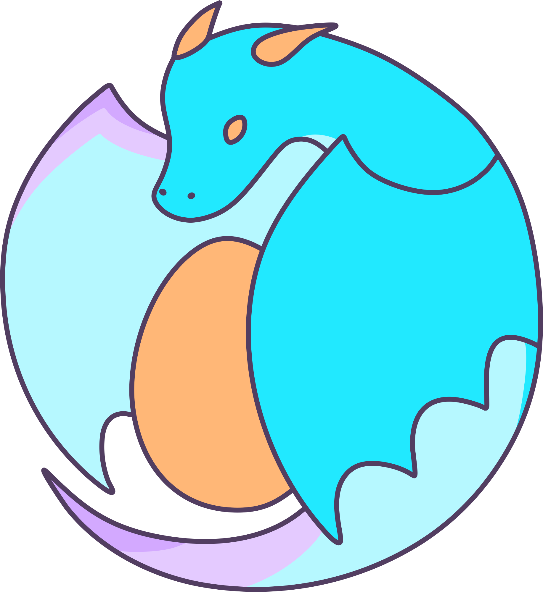

<h1 align=center>
  
    
Stowarzyszenie OwO 

</h1>

**Stowarzyszenie OwO to organizacja, która powstała, by wspierać ludzi zainteresowanych subkulturą furry – to społeczność miłośników postaci łączących cechy ludzi i zwierząt. Chcemy pomagać im się integrować, rozwijać swoje pasje i czuć się akceptowanymi.**

## Nasze cele:  
  
- **Budowanie społeczności** – organizujemy i współorganizujemy spotkania, warsztaty i wydarzenia, które łączą ludzi o podobnych zainteresowaniach.  
- **Promowanie subkultury furry** – pokazujemy, że to ciekawa i wartościowa forma - twórczości, np. poprzez sztukę, tworzenie strojów (fursuitów) czy inne działania artystyczne.  
- **Walka z dyskryminacją i szerzenie tolerancji** – uczymy otwartości, zrozumienia i akceptacji dla innych.  
- **Pomoc i wsparcie** – wspieramy osoby potrzebujące pomocy, organizujemy zbiórki i działania charytatywne, a także promujemy zdrowy styl życia.  
  
## Jak działamy?  
  
Organizujemy i współorganizujemy różnego rodzaju wydarzenia – od lokalnych spotkań po większe imprezy. Tworzymy przestrzeń, gdzie każdy może wyrazić siebie, znaleźć przyjaciół i rozwijać swoje pasje. Działamy na rzecz ochrony zwierząt, dbamy o środowisko i wspieramy twórczość artystyczną. Naszym celem jest, by każdy mógł poczuć się częścią otwartej i przyjaznej społeczności.  
  
W skrócie – jesteśmy tu, by łączyć ludzi, inspirować ich i wspierać w robieniu tego, co kochają!  
   
<h1 align=center> Dowiedz się więcej na <a href='https://owo.org.pl'>naszej stronie internetowej</a> </h1>
   
  
### Dane podmiotu

STOWARZYSZENIE OWO  
UL. ZAMKNIĘTA 10 / 1.5  
30-554 KRAKÓW  

KRS 0001100597  
NIP 6793296635  
REGON 528389147  
